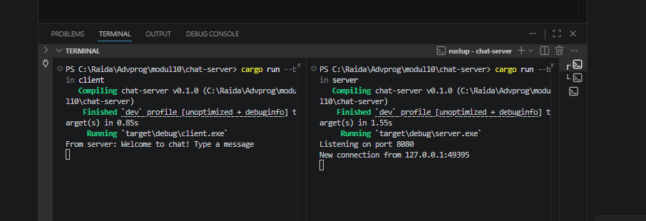
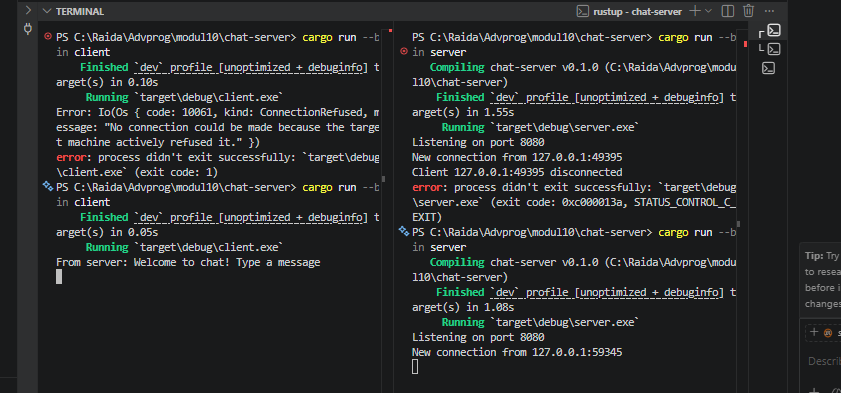

# Experiment 2.1: Original code, and how it run

## Screenshot

## Penjelasan

Pada experiment ini, satu server dijalankan dan tiga client terhubung secara bersamaan menggunakan WebSocket. Server berjalan di port `2000` dan mendengarkan koneksi masuk. Setiap client yang berhasil terhubung akan menerima pesan sambutan "Welcome to chat! Type a message" dari server. Ketika salah satu client mengetik pesan dan menekan Enter, server menerima pesan tersebut lalu menyiarkannya (broadcast) ke semua client lain yang sedang terhubung. Hal ini dimungkinkan karena server menggunakan `tokio::sync::broadcast::channel` yang mendistribusikan pesan ke semua subscriber secara asynchronous.

---

# Experiment 2.2: Modifying port

## Penjelasan

Pada experiment ini, port diubah dari `2000` menjadi `8080`. Perubahan harus dilakukan di **dua tempat** sekaligus — di `src/server.rs` pada baris `TcpListener::bind` dan di `src/client.rs` pada baris `ClientBuilder::from_uri`. Ini karena WebSocket adalah protokol komunikasi dua arah, sehingga server dan client harus "berbicara" di port yang sama. Jika hanya salah satu yang diubah, client akan mendapat error `ConnectionRefused` karena mencoba konek ke port yang tidak ada yang mendengarkan. Setelah kedua sisi diubah ke `8080`, program berjalan normal seperti sebelumnya.

---

# Experiment 2.3: Small changes, add IP and Port

## Screenshot

## Penjelasan

Pada experiment ini, pesan broadcast dimodifikasi agar menyertakan informasi IP address dan port dari pengirim. Perubahan dilakukan di `src/server.rs` dengan mengubah format string broadcast dari hanya teks pesan menjadi `"From {addr}: {text}"`. Variabel `addr` bertipe `SocketAddr` yang sudah tersedia sebagai parameter fungsi `handle_connection`, sehingga tidak perlu perubahan besar. Dengan modifikasi ini, setiap client yang menerima pesan bisa mengetahui dari mana pesan tersebut berasal berdasarkan kombinasi IP dan port pengirim. Ini mensimulasikan identitas pengguna sederhana sebelum ada sistem nama pengguna yang sesungguhnya.